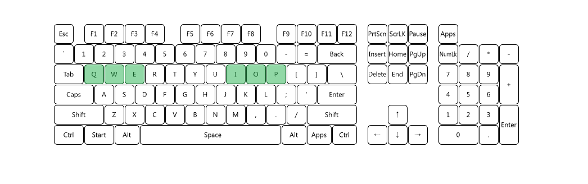
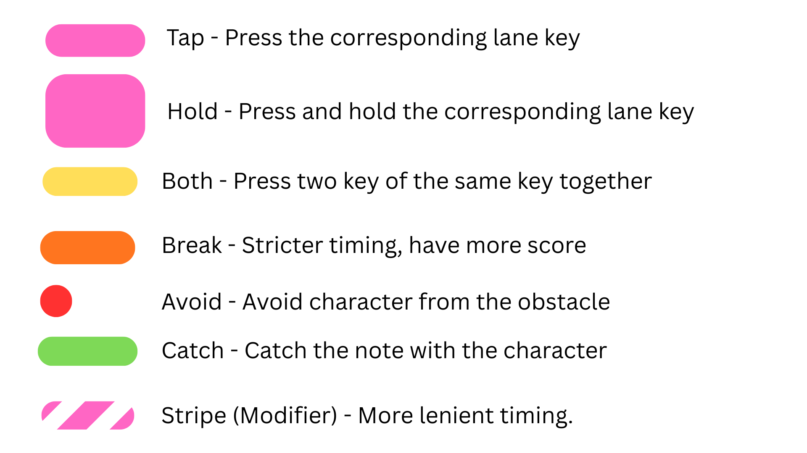

# Project TriSweep

## IMPORTANT:
### Read Tutorial / Usage below before playing.

## Project Description

- Project by: Pichaya Yawiset
- Game Genre: Rhythm

A 3 lane vertical scrolling rhythm game with a hint of danmaku.

Created as a final project for subject 01219116 and 01219117 Computer Programming II.

---

## Installation
To Clone this project:
```sh
git clone https://github.com/User-NotExist/Project-TriSweep.git
```

To create and run Python Environment for This project:

Window:
```bat
python -m venv .venv
.venv\Scripts\activate
pip install -r requirements.txt
```

Mac:
```sh
python3 -m venv .venv
source .venv/bin/activate
pip install -r requirements.txt
```

---

## Running Guide
After activate Python Environment of this project, you can process to run the game by:

Window:
```bat
python main.py
```

Mac:
```sh
python3 main.py
```

---

## Tutorial / Usage
### Important!!!
Keyboard without N-key rollover may experience keyboard jamming (keypress not registering) when using a certain key combination.

Please check if you can press 6 of the note key simultaneously here: https://drakeirving.github.io/MultiKeyDisplay/

This is a valid keybind:


### Default Lane Binding

| Key |             Function |
|:---:|---------------------:|
|  Q  |  Left side of lane 0 |
|  I  | Right side of lane 0 |
|  W  |  Left side of lane 1 |
|  O  | Right side of lane 1 |
|  E  |  Left side of lane 2 |
|  P  | Right side of lane 2 |
#### Mouse Horizontal movement for player movement.

### Additional Binding
| Key | Function                                                                               |
|-----|----------------------------------------------------------------------------------------|
| ESC | Return to previous page / Hold to track skip while playing.                            |
| TAB | Shows play record table for the selected song and difficulty (Song select screen only) |

## Note Types



---

## Known Bugs
- Missing/Invalid player picture can crash the game.

---

## Unfinished Works
- Sound effect for button/key press

---

## External sources
Acknowledge to:
1. Scene Manager Template, https://nerdparadise.com/programming/pygame/part7 [game source code]
2. [FeuxFollet](https://github.com/FeuxFollet) [default player image]
3. [RGredsky](https://soundcloud.com/rgredsky) [music [Enigmatic](https://soundcloud.com/rgredsky/rgredsky-enigmatic)]

