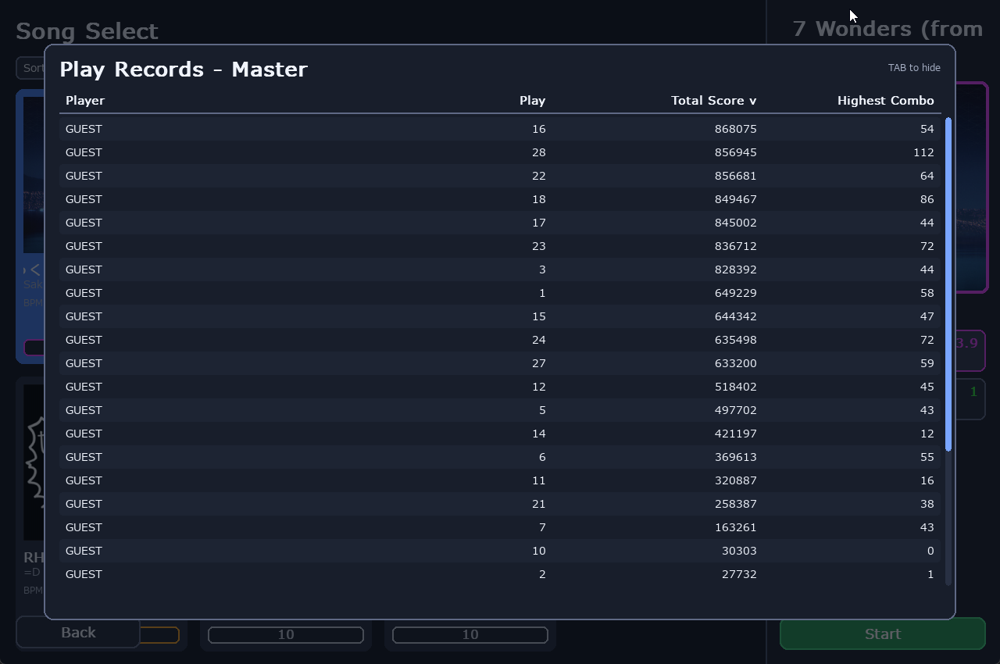
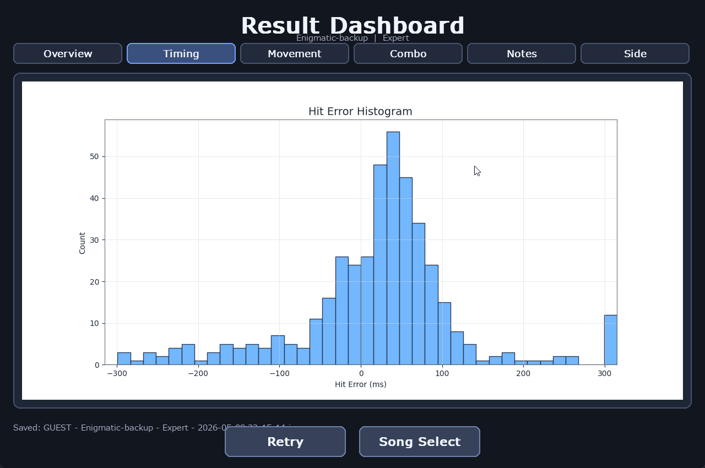
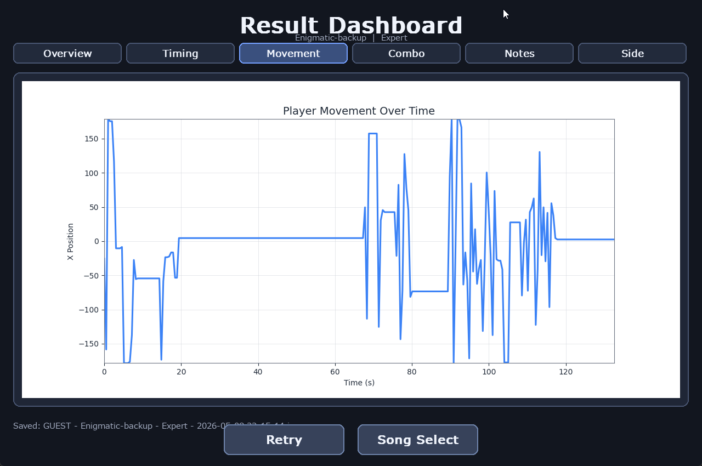
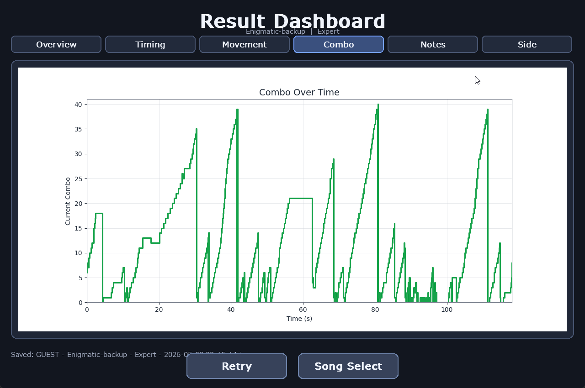
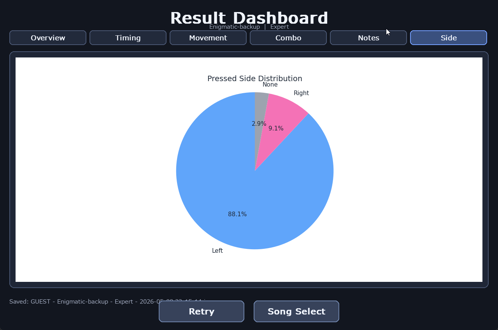
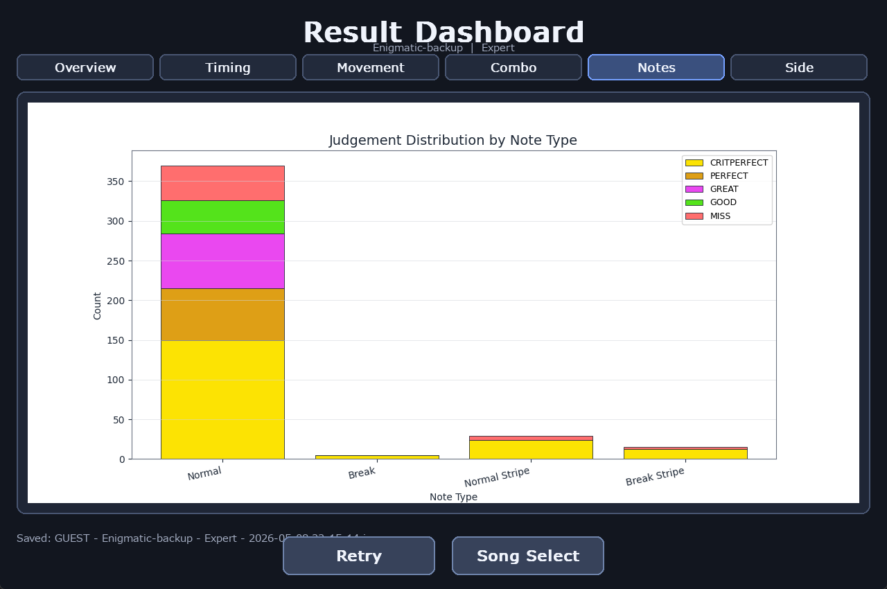

# Data Visualization

---
## 1. Record Table

Shows the player name and the play number, also shows score and maximum combo achieved in that play.

---
## 2. Hit Error Histrogram

Shows the hit error frequency in the play. The x-axis represent the miliseconds that were off from -300 to 300. (Capped because outlier can only happen when track skipping.)
The y-axis shows how many times the hit error occured in that range. We can see that graph is a bit right-skewed but still acceptable as a normal distribution.
However this shows that players tends to hit the note late than early/on time.

---
## 3. Player X Position to time Line Graph

Shows the player X position over time. The x-axis represent the time in seconds and the y-axis represent the player position.
This data shows that player doesn't move their mouse for half of the time. During the other half, player move very erratically.
This data can shows the chart author where there chart can have more or less mouse action.

---
## 4. (Extra line chart) Combo overtime Step Graph

Shows the combo streak over time. The x-axis represend the time in seconds and the y-axis represent the combo of the current play.
This data shows where the player struggle in the song represented by the sudden drop in the graph. This graph use a step graph because combo
isn't a linear data that have a decimal point. Therefore step graph were use to be fitting (and to show the drop more dramatically).
---
## 5. Left vs Right input Pie Chart

Shows the ratio of the left, right, and no input side. From this chart we can observe that player mostly use their left side of the keyboard
to press the key compared to the right side. This is expected as people will use their left hand as a keyboard input hand and use right hand for mouse movement.

---
## 6. Judgement Level Distribution Stacked Bar Graph

Shows the distribution of the note_type in the chart and the judgement of the play. X-axis represent the note_type while y_axis represent the count of the said note_type.
Additionally, color were used to seperate the judgement level from MISS to CRITPERFECT.
From the data we can see that normal note count far exceed the count for other note type. Additionally, player seem to hit half of the note in CRITPERFECT level.
The other half were then split equally between other judgement level.